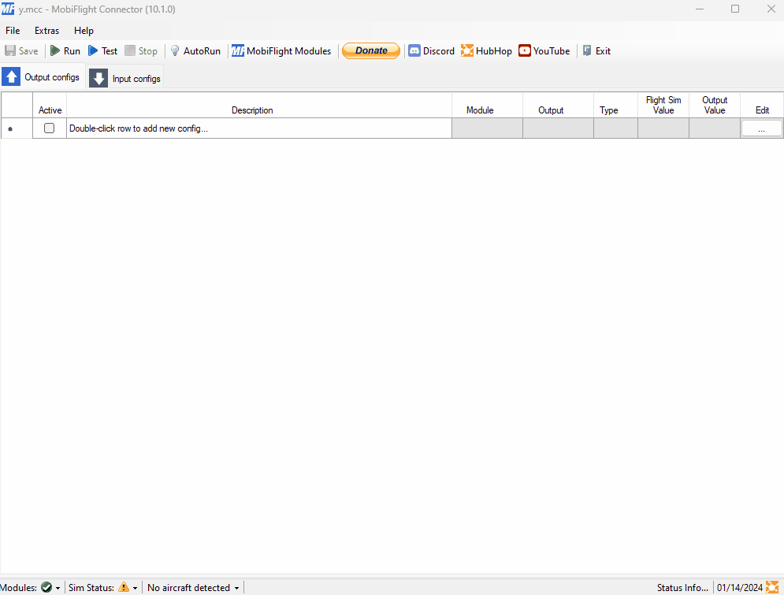
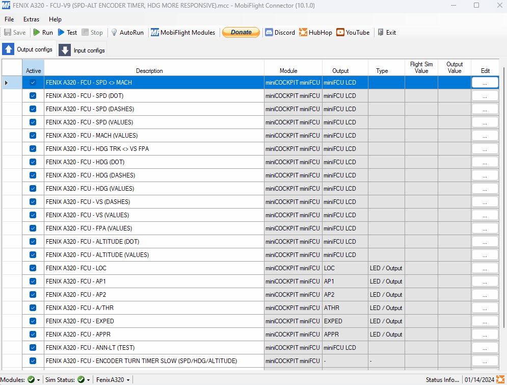

# MobiFlight-miniFCU-Profiles

## MobiFlight Download
https://www.mobiflight.com/en/download.html

## Profile list

### MSFS2020
- [miniFCU | Default FlyByWire | MobiFlight profile](https://github.com/MobiFlight/MobiFlight-Connector/blob/main/Community/miniCOCKPIT/profiles/msfs2020/FBW-a320.mcc)
  - Also in MobiFlight installation directory e.g.:
  - C:\Users\\**YourAccount**\AppData\Local\MobiFlight\MobiFlight Connector\Community\miniCOCKPIT\profiles\msfs2020
- [miniFCU | Sushiat FlyByWire | MobiFlight profile](https://flightsim.to/file/69451/a32nx-minicockpit-minifcu-mobiflight-profile)
- miniFCU | Horizon Mod for LFVR A319, A320, A321 | MobiFlight profile | -> Use above FlyByWire profiles. Sushiat FlyByWire is recommended.
- [miniFCU | Fenix A320 | MobiFlight profile](https://flightsim.to/file/67139/fenix-a320-minicockpit-minifcu-mobiflight-profile-quartz-displays-full-installation)
- [miniFCU | Generic AP (ASOBO planes) | MobiFlight profile](https://flightsim.to/file/67143/generic-ap-asobo-planes-minicockpit-minifcu-mobiflight-profile-full-installation)
   - Works with Blacksquare TBM850, PA28 Arrow IV
- [miniFCU | iniBuilds A300 | MobiFlight Profile](https://flightsim.to/file/66522/minifcu-inibuilds-a300-profile)
- [miniFCU | iniBuilds A310 | MobiFlight Profile](https://flightsim.to/file/69432/minifcu-inibuilds-a310-profile)
- [miniFCU | Sushiat iniBuilds A300/A310 | MobiFlight Profile](https://flightsim.to/file/69438/inibuilds-a300-a310-minicockpit-minifcu-mobiflight-profile)
- [miniFCU | PMDG B737NG | MobiFlight Profile](https://flightsim.to/file/66653/pmdg-b737ng-minicockpit-minifcu-mobiflight-profiles)
- [miniFCU | Kuro/Horizon/WT B787-8, B787-9, B787-10 | MobiFlight Profile](https://flightsim.to/file/67371/wt-kuro-horizon-b787-minicockpit-minifcu-mobiflight-profiles)
- [miniFCU | Flysimware Learjet 35A | MobiFlight Profile](https://flightsim.to/file/67951/flysimware-learjet-35a-minicockpit-minifcu-mobiflight-profile)
- [miniFCU | Asobo ATR 42/72-600 | MobiFlight Profile](https://flightsim.to/file/69229/asobo-atr-600-minicockpit-minifcu-mobiflight-profile)
- [miniFCU | Aerosoft CRJ 550/700/900/1000 | MobiFlight Profile](https://flightsim.to/file/69389/aerosoft-crj-550-700-900-1000-minicockpit-minifcu-mobiflight-profile)
- [miniFCU | Fly the MADDOG X | MobiFlight Profile](https://flightsim.to/file/68958/fly-the-maddog-x-minicockpit-minifcu-mobiflight-profile)
- [miniFCU | Citation CJ4 | MobiFlight Profile](https://flightsim.to/file/69550/citation-cj4-minicockpit-minifcu-mobiflight-profile)

### X-Plane
- [miniFCU | Toliss A321 | MobiFlight Profile](https://github.com/eric-schalk/MobiFlightProfiles/releases)
- [miniFCU | Toliss A321 | MobiFlight Profile x-plane.to](https://x-plane.to/file/1254/minifcu-mobiflight-profile-for-toliss-a321)
- [miniFCU | Laminar A330 | MobiFlight Profile](https://github.com/eric-schalk/MobiFlightProfiles/releases)
- [miniFCU | Flight Factor A350 | MobiFlight Profile](https://discord.com/channels/608690978081210392/1190043120914665542/1193208598298382417) You need to join the [MobiFlight Discord]( https://discord.gg/QjCQXSQs5K) to download.

### P3D
- [miniFCU | FSLabs A32x | MobiFlight Profile](https://github.com/Koseng/MobiFlight-miniFCU-Profiles/releases/latest)

## Instructions
1) Close the miniFCU data link software. It is not needed and conflicts if run in parallel.
2) Download and install [MobiFlight](https://www.mobiflight.com/en/download.html)
3) Install MobiFlight WASM module via menu Extras->MSFS2020->Install WASM module
4) Perform miniFCU update to official MobiFlight firmware, see below. Do not forget to press "Upload" as well.
5) Now you can load the plane profiles. Do not forget to assign your board serial to a new profile and save. See below.
6) Link config to plane for autoload if desired. See below.
7) Press play button in MobiFlight.

For community support, join the [miniFCU Community Discord](https://discord.gg/63ypEhYkft)

### Update to official MobiFlight firmware

### Switch back to official standard firmware

### Assign board serial to new plane profile

### Link config to plane for autoload

