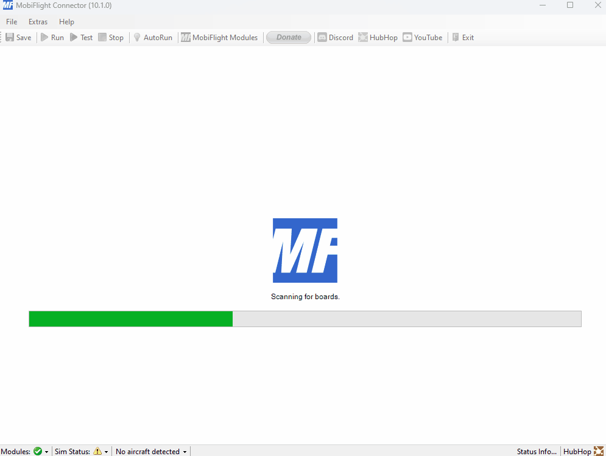

# MobiFlight-miniFCU-Profiles

## MobiFlight Download
https://www.mobiflight.com/en/download.html

## List of profile links

### MSFS2020
- miniFCU | FlyByWire | MobiFlight profile
  - In MobiFlight installation directory e.g.:
  - C:\Users\\**YourAccount**\AppData\Local\MobiFlight\MobiFlight Connector\Community\miniCOCKPIT\profiles\msfs2020
- [miniFCU | Fenix A320 | MobiFlight profile](https://flightsim.to/file/67139/fenix-a320-minicockpit-minifcu-mobiflight-profile-quartz-displays-full-installation)
- [miniFCU | Generic AP (ASOBO planes) | MobiFlight profile](https://flightsim.to/file/67143/generic-ap-asobo-planes-minicockpit-minifcu-mobiflight-profile-full-installation)
- [miniFCU | iniBuilds A300 | MobiFlight Profile](https://flightsim.to/file/66522/minifcu-inibuilds-a300-profile)
- [miniFCU | PMDG B737NG | MobiFlight Profile](https://flightsim.to/file/66653/pmdg-b737ng-minicockpit-minifcu-mobiflight-profiles)
- [miniFCU | Kuro/Horizon/WT B787-8, B787-9, B787-10 | MobiFlight Profile](https://flightsim.to/file/67371/wt-kuro-horizon-b787-minicockpit-minifcu-mobiflight-profiles)
- [miniFCU | Flysimware Learjet 35A (Early Access) | MobiFlight Profile](https://discord.com/channels/1183936462996127904/1194694498194825368)

### X-Plane
- [miniFCU | Toliss A321 | MobiFlight Profile](https://github.com/eric-schalk/MobiFlightProfiles/releases)
- [miniFCU | Toliss A321 | MobiFlight Profile x-plane.to](https://x-plane.to/file/1254/minifcu-mobiflight-profile-for-toliss-a321)
- [miniFCU | Laminar A330 | MobiFlight Profile](https://github.com/eric-schalk/MobiFlightProfiles/releases)
- [miniFCU | Flight Factor A350 | MobiFlight Profile](https://discord.com/channels/608690978081210392/1190043120914665542/1193208598298382417)

## Update to official MobiFlight firmware

## Switch back to official standard firmware

## Assign board serial to new plane config

## Link config to plane name for autoload

